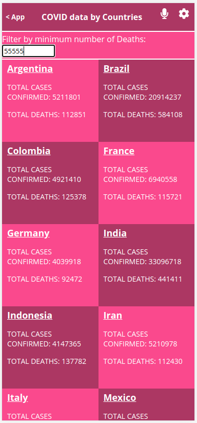

# react-metrics-webapp

> Single Page Application that fetch data Narrativa COVID API, lists the metrics by city and displays additional information when clicked each city link.

## Live version

You can access the live version [here](https://compassionate-mcnulty-b5a7df.netlify.app/).

(Resize the page or inspect and select "mobile" to see the responsive version)

## Video presentation

You can access the video presentation of the project [here](https://www.loom.com/share/c6a43bddc4ef4909a79ce1dd5eb0ff15).

## Built With

- JavaScript/React
- React Router
- React-redux
- Redux-logger
- JSX
- CSS
- VSCode
- Webpack
- Babel
- Ubuntu 20.04.3
- Linters
- Jest

## Setup

- Get the link of the repository: `git@github.com:arthurborgesdev/react-metrics-webapp.git`
- Clone it as `git@github.com:arthurborgesdev/react-metrics-webapp.git` on a Terminal
- Change directory to it by `cd react-metrics-webapp`

## Usage

(If you are a Microverse's code reviewer, change to the correct branch before: `git checkout capstone-project`)

- Run `npm install` on a Terminal to install the modules
- Run `yarn start` on a Terminal to start the server 
- Open [http://localhost:3000](http://localhost:3000) to view it in the browser.

## Tests

- Run `npm test` on a Terminal to run the test suite

## Author

👤 **Arthur Borges**

- GitHub: [@arthuborgesdev](https://github.com/arthurborgesdev)
- Twitter: [@arthurmoises](https://twitter.com/arthurmoises)
- LinkedIn: [Arthur Borges](https://linkedin.com/in/arthurmoises)

## 🤝 Contributing

Contributions, issues, and feature requests are welcome!

## Show your support

Give a ⭐️ if you like this project!

## Acknowledgments

- Microverse
- React, Redux and React Router documentation
- Lots and lots of Stack Overflow questions and answers
- Original design idea by [Nelson Sakwa on Behance](https://www.behance.net/sakwadesignstudio).